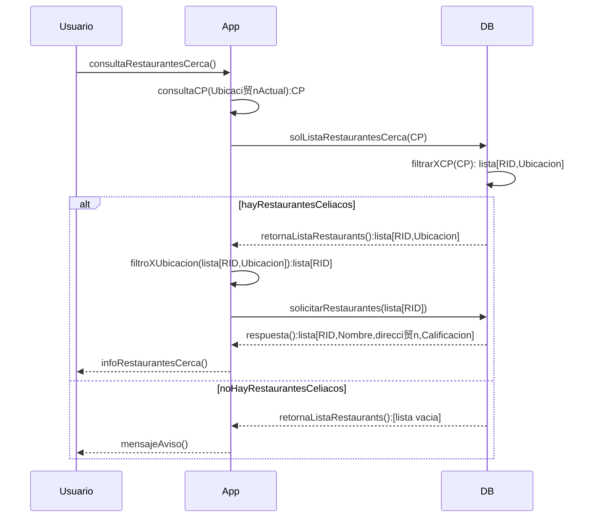

<h1>Diagrama de Secuencia</h1>

Búsqueda de Restaurantes para Celíacos cerca de la ubicación del Usuario.

```mermaid
sequenceDiagram
participant Usuario
participant App
participant DB
Usuario->>App: consultaRestaurantesCerca()
App->>App: consultaCP(Ubicaci贸nActual):CP
App->>DB: solListaRestaurantesCerca(CP)
DB->>DB: filtrarXCP(CP): lista[RID,Ubicacion]
alt hayRestaurantesCeliacos
DB-->>App: retornaListaRestaurants():lista[RID,Ubicacion]
App->>App: filtroXUbicacion(lista[RID,Ubicacion]):lista[RID]
App->>DB: solicitarRestaurantes(lista[RID])
DB-->>App: respuesta():lista[RID,Nombre,direcci贸n,Calificacion]
App-->>Usuario: infoRestaurantesCerca()
else noHayRestaurantesCeliacos
DB-->>App: retornaListaRestaurants():[lista vacia]
App-->>Usuario: mensajeAviso()
end
```

