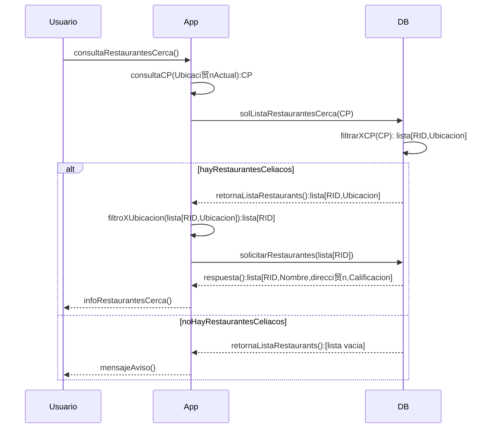

# Diagramas del Proyecto

[TOC]

## Diagrama de Uso

## Diagrama Entidad-Relación

**Restaurante**(<u>IDR</u>,Nombre,Ubicacion,TieneMenuCel,CalifFinal);

**Usuario**(<u>IDU</u>, Nombre, Apellido, Edad, Email, Passwd, NroTelefono, esCeliaco, tokenFacebook);

**Califico**(<u>IDU</u>,<u>IDR</u>, CalidadServicio, Atencion, Precio, Higiene);

**Ciudad**(<u>CP</u>, Nombre, Poblacion, PoblacionCeliacos);

**estaUbicado**(<u>IDR</u>,<u>CP</u>,<u>Puesto</u>);

**viveEn**(<u>IDU</u>, <u>CP</u>);

### Aclaraciones

1. **TokenFacebook:** este valor se obtiene al loguearse con Auth0 (autenticación por facebook)
2. **Ubiacion:** latitud y longitud (según como lo almacene GoogleMaps)
3. etc, etc

## Diagramas de Secuencia

### Búsqueda de Restaurantes para Celíacos cerca de la ubicación del Usuario.

